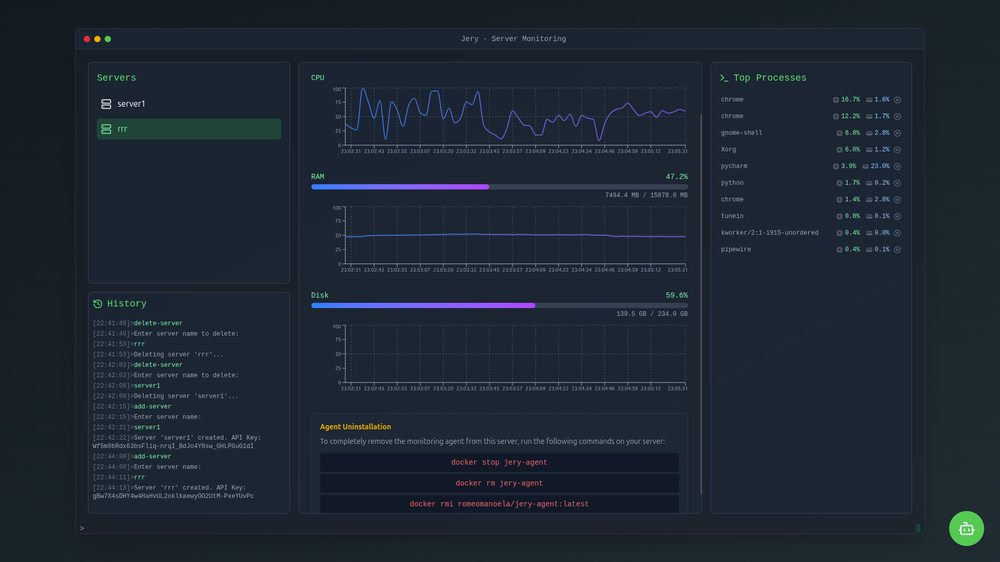

# Jery - Real-Time Server Monitoring Dashboard



Jery is a full-stack application designed to provide real-time monitoring of your server's health and performance. It features a modern and intuitive web interface to visualize metrics, a powerful backend to process data, and a lightweight agent to collect information from your machines.

## ✨ Key Features

- **Real-Time Metrics:** Visualize CPU, memory, and other system metrics in real-time through a WebSocket-based connection.
- **Server & Process Management:** List all connected servers, view their details, and inspect running processes.
- **Secure Authentication:** User registration and login system secured with JSON Web Tokens (JWT).
- **Scalable Architecture:** The decoupled architecture with a dedicated agent allows for monitoring multiple servers simultaneously.
- **Containerized Deployment:** The backend and agent are fully containerized with Docker for easy setup and deployment.

## 🏗️ Architecture

The project is composed of three main components that work together:

1.  **Frontend:** A **Next.js (React)** single-page application that provides the user interface. It communicates with the backend via a REST API for data retrieval and a WebSocket connection for real-time updates.
2.  **Backend:** A **Python (FastAPI)** server that acts as the central hub. It handles user authentication, stores data in a database, and manages communication between the frontend and the agents.
3.  **Agent:** A lightweight **Python** script that runs on each monitored server. It collects system metrics and sends them periodically to the backend for processing.

```
┌──────────┐      ┌────────────────┐      ┌───────────┐
│          │      │                │      │           │
│  Agent   ├─────►│    Backend     │◄─────┤ Frontend  │
│          │      │ (FastAPI)      │      │  (Next.js)│
└──────────┘      └────────────────┘      └───────────┘
```

## 🛠️ Tech Stack

- **Frontend:**
  - [Next.js](https://nextjs.org/)
  - [React](https://reactjs.org/)
  - [TypeScript](https://www.typescriptlang.org/)
  - [Redux Toolkit](https://redux-toolkit.js.org/)
  - [Tailwind CSS](https://tailwindcss.com/)

- **Backend:**
  - [Python](https://www.python.org/)
  - [FastAPI](https://fastapi.tiangolo.com/)
  - [SQLAlchemy](https://www.sqlalchemy.org/)
  - [Alembic](https://alembic.sqlalchemy.org/)
  - [Docker](https://www.docker.com/)

- **Agent:**
  - [Python](https://www.python.org/)
  - [Docker](https://www.docker.com/)
